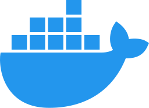
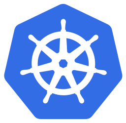
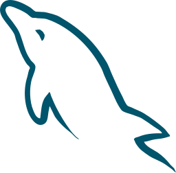
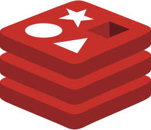

## I am
株式会社ドワンゴにてN予備校のAndroid Appの開発をしている飯田剛通です。

## 🔭My Skil

### スキルセット

#### Android 3年

アーキテクチャ - MVVM
 使用ライブラリ - Jetpack compose/Retrofit/Coroutine Flow/Multi Module/Junit/Moshi/Mock
 CD/CI - Bitris
 Data - Firebase
 環境 - Git/Pay Console

#### Go 2年

フレームワーク - echo
 DB - postgreSQL/redis
 Message Que - rabbitmq
 環境 - Docker/Kubernetes

#### ruby 2年

フレームワーク - rails
 DB - Mysql
 サーバー - Heroku

#### BlockChain - 1年

使用通貨 - Ethereum
 言語 Node.js/ Solidity
 DB - ifps

#### VB 1年

フレームワーク - .NET
 DB - Oracle

## My Job career

### 株式会社ドワンゴ

#### 在籍期間: 2021/11 ～

#### 業務内容

1. [N予備校のAndroidアプリ](https://play.google.com/store/apps/details?id=nico.ed.nnn.zane&hl=ja&gl=US&pli=1)の保守運用・リファクタリング・リリースをおこなっておりました。
    - 新規画面の作成: 他のクライアント・デザイナー・バックエンドのチームと連携しての開発
    - リファクタリング: Jetpack compose/Retrofit/Coroutine Flowの導入
    - Google Play Store Consoleにてリリース
    - インターン生の教育

---

### ドレミング株式会社

#### 在籍期間: 2020/4 ～2021/10

#### 業務内容

 1. 決済サービスの要件定義から開発まで
    - 使用スキル [Go](#go-2年)
    - マイクロサービスを運用しておりバックエンドのgatewayサーバー, 認証サーバー，決済サーバーの開発をしていました。
 2. 決済Androidアプリの開発
    - Androidの決済アプリをバックエンドと連携して運用できるようにかいはつしていました
 3. 人事サイトの保守
    - PHPのSymphonyを使用したアプリの保守をおこなっていました

---

### 株式会社アソウアルファ

#### 在籍期間: 2019/4 ～2020/3

#### 業務内容 

 1. oracleで取得したデータをVBAで分析
 2. NETを使用したチェーン店の業務要塞との保守運用
 3. 小売業者のデータ分析webの開発

---

### 株式会社div (インターン)

#### 在籍期間: 2017/4 ～2019/3

#### 業務内容

1. ruby on railesのメンター
2. 体験会でのセールス

---

## 👯Looking for

副業を探しています。
平日週20時間～　土日も可能です
Androidエンジニア、フロント、バックエンドで探しています。
お誘いいただける方[twitter](https://twitter.com/gorillaz815)にDMいただきたいです。