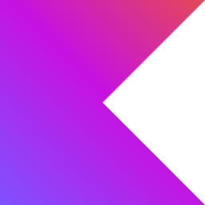

## I am
株式会社ドワンゴにてN予備校のAndroid Appの開発をしている飯田剛通です。

## 🔭My Skil

スキルセット
Android 3年
アーキテクチャ - MVVM
 使用ライブラリ - Jetpack compose/Retrofit/Coroutine Flow/Multi Module/Junit/Moshi/Mock
 CD/CI - Bitris
 Data - Firebase
 環境 - Git/Pay Console

Go 2年
 フレームワーク - echo
 DB - postgreSQL/redis
 Message Que - rabbitmq
 環境 - Docker/Kubernetes

ruby 2年
 フレームワーク - rails
 DB - Mysql
 サーバー - Heroku

BlockChain - 1年
 使用通貨 - Ethereum
 言語 Node.js/ Solidity
 DB - ifps

VB 1年
 フレームワーク - .NET
 DB - Oracle

## My Job career

## 👯Looking for

