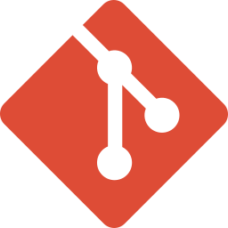

## I am
出前館にてアプリ開発をしている飯田剛通です。
エンジニア歴は7年くらいになります。現在はFlutterを用いたモバイルアプリケーション開発を主軸に、ユーザー体験の向上と安定したサービス提供に貢献しています。
副業も積極的に探しており、Androidネイティブ開発、バックエンド開発（Go, Ruby on Rails）、フロントエンド開発など、これまでの経験を活かせる分野で新しいチャレンジをしたいと考えています。
平日週10時間～、土日も柔軟に対応可能です。
お気軽にお声がけください。[Twitter DM](https://twitter.com/gorillaz815)

## 🔭My Skil

### スキルセット

#### Android: 3年
- **アーキテクチャ:** MVVMを基本とし、Clean Architectureの思想を取り入れた設計を経験。
- **言語:** Kotlin (Coroutine, Flowを積極的に活用)
- **UI:** Jetpack Composeによる宣言的UI開発、従来のXMLレイアウト開発双方に対応。
- **ライブラリ:** Retrofit, OkHttp, Moshi/Gson, Dagger/Hilt, Room, DataStore, JUnit, MockK, Espressoなど。
- **CI/CD:** Bitrise, GitHub Actionsを用いたビルド・テスト・デプロイの自動化。
- **その他:** Firebase (Analytics, Crashlytics, Remote Configなど), Google Play Consoleでのリリース管理、マルチモジュール構成による開発。

#### Flutter: (出前館での経験年数に応じて追記)
- **状態管理:** Bloc/Cubitパターンを用いたビジネスロジックの実装。
- **API連携:** GraphQL (クライアントライブラリ: Ferry) を用いた効率的なデータ取得・更新。
- **ライブラリ:** (その他、主要なライブラリがあれば追記)
- **テスト:** (ユニットテスト、ウィジェットテストなどの経験があれば追記)

#### Go: 2年
- **フレームワーク:** Echoを用いたAPIサーバー開発。
- **データベース:** PostgreSQL, Redisとの連携。
- **メッセージキュー:** RabbitMQを用いた非同期処理の実装。
- **インフラ:** Docker, Kubernetes環境での開発・運用経験。
- **CI/CD:** Jenkinsを用いたビルド・デプロイパイプラインの構築・運用。

#### Ruby: 2年
- **フレームワーク:** Ruby on Railsを用いたWebアプリケーション開発。
- **データベース:** MySQLとの連携。
- **サーバー:** Heroku環境でのデプロイ・運用経験。

#### Blockchain: 1年
- **プラットフォーム:** Ethereum上でのスマートコントラクト開発。
- **言語:** Solidity, Node.js
- **データベース/ストレージ:** IPFS

#### VB.NET: 1年
- **フレームワーク:** .NET Framework
- **データベース:** Oracle Database

## My Job career

### 株式会社出前館

#### 在籍期間: 2025/4 ～ 現在

#### 業務内容

出前館のモバイルアプリケーション開発チームにて、Flutterを用いた開発を担当しています。ユーザーにとってより使いやすく、信頼性の高いサービスを提供するため、新機能の開発や既存機能の改善に積極的に取り組んでいます。

-   **Flutterアプリケーション開発:**
    -   Bloc/Cubitパターンに基づいた状態管理とビジネスロジックの実装を行い、見通しが良くメンテナンス性の高いコードベースの構築に貢献。
    -   GraphQL (クライアントライブラリ: Ferry) を活用し、サーバーとの効率的なデータ連携を実現。API仕様の策定段階から関与し、最適なデータフローを設計。
    -   新規機能の企画・設計から実装、テスト、リリースまでの一連のサイクルを担当。UI/UXデザイナーやバックエンドエンジニアと密に連携し、ユーザー価値の最大化を目指す。
    -   パフォーマンスチューニングやエラー監視体制の強化にも取り組み、アプリケーションの品質向上に努める。
-   **BFF (Backend For Frontend) の保守・運用:**
    -   TypeScriptで記述されたBFF層の保守開発を担当。モバイルアプリケーションが必要とするデータを効率的に提供するためのAPI改修や、パフォーマンス改善を実施。
    -   BFFとモバイルアプリケーション間のインターフェース設計にも関与し、双方の開発効率向上に貢献。

---

### 株式会社ドワンゴ

#### 在籍期間: 2021/11 ～ 2024/3

#### 業務内容

オンライン学習プラットフォーム「N予備校」のAndroidアプリケーション開発チームに所属し、生徒の学習体験向上を目指した開発業務全般に従事しました。

-   **N予備校Androidアプリの機能開発・保守・運用:**
    -   新規学習機能（例：〇〇機能、△△機能）の設計・実装を担当。企画段階からデザイナーやバックエンドエンジニアと協働し、ユーザー中心の設計を推進。
    -   既存機能のリファクタリングを主導し、Jetpack Composeの導入やCoroutine/Flowへの置き換えを推進。これにより、開発効率の向上とコード品質の改善を実現。特にCompose化においては、段階的な導入計画を策定し、スムーズな移行に貢献。
    -   Google Play Consoleを用いたアプリのリリース管理、バージョン管理、ストア掲載情報の更新などを担当。Bitriseを用いたCI/CD環境の改善にも取り組み、リリースサイクルの短縮化に貢献。
    -   Firebase CrashlyticsやAnalyticsを活用したエラー分析・ユーザー行動分析に基づき、継続的な改善活動を推進。
-   **インターン生の指導・育成:**
    -   Android開発未経験のインターン生に対し、技術指導やメンタリングを実施。開発タスクのアサインやコードレビューを通じて、実践的なスキル習得をサポート。
-   **試験専用Androidアプリのリファクタリング:**
    -   N予備校とは別に、試験環境に特化したAndroidアプリの技術負債解消を目的としたリファクタリングプロジェクトを推進。アーキテクチャの見直しやライブラリのモダン化を行い、保守性と拡張性を大幅に向上。

---

### ドレミング株式会社

#### 在籍期間: 2020/4 ～ 2021/10

#### 業務内容

フィンテック領域における決済サービスの開発に、バックエンドエンジニアおよびAndroidエンジニアとして携わりました。

-   **決済サービスのバックエンド開発 (Go):**
    -   マイクロサービスアーキテクチャで構築された決済システムのAPI開発を担当。主にゲートウェイサーバー、認証サーバー、決済処理サーバーの機能拡張や保守に従事。
    -   Echoフレームワークを使用し、PostgreSQLやRedisと連携した堅牢なシステムを構築。RabbitMQを用いた非同期処理の導入により、システムの応答性向上に貢献。
    -   Docker/Kubernetes環境での開発・運用を経験し、コンテナ技術への理解を深める。
-   **決済Androidアプリの開発:**
    -   自社決済サービスと連携するAndroidアプリケーションの開発を担当。NFCを用いた決済機能や、取引履歴表示機能などを実装。
    -   バックエンドチームと連携し、API仕様の策定からアプリ側の実装までを一貫して担当。
-   **人事関連Webサイトの保守 (PHP):**
    -   PHP (Symphonyフレームワーク) で構築された既存の人事関連Webサイトの機能追加や不具合修正などの保守業務を担当。

---

### 株式会社アソウアルファ

#### 在籍期間: 2019/4 ～ 2020/3

#### 業務内容

主に業務系システムの開発やデータ分析業務に携わりました。

-   **データ分析業務 (VBA, Oracle):**
    -   Oracleデータベースに蓄積された販売データを抽出し、VBAを用いて集計・分析。分析結果を基にしたレポート作成や業務改善提案を実施。
-   **チェーン店向け業務システムの保守・運用 (.NET):**
    -   VB.NETで開発された既存の業務システム（在庫管理、受発注システムなど）の保守運用を担当。ユーザーからの問い合わせ対応、不具合修正、小規模な機能追加などを実施。
-   **小売業者向けデータ分析Webアプリケーションの開発:**
    -   顧客データや購買データを分析し、可視化するWebアプリケーションの新規開発に参画。主にフロントエンド（JavaScript, HTML, CSS）と一部バックエンド（Python/Django）の開発を担当。

---

### 株式会社div (インターン)

#### 在籍期間: 2017/4 ～ 2019/3

#### 業務内容

プログラミングスクール「TECH::CAMP（現: テックキャンプ）」にて、受講生の学習サポートおよびプログラミング学習の啓蒙活動に携わりました。

-   **Ruby on Railsコースのメンター:**
    -   受講生からの技術的な質問対応、課題のレビュー、学習進捗の管理などを担当。個々の理解度に合わせた丁寧な指導を心がけ、多くの受講生のスキル習得を支援。
-   **プログラミング体験会の運営・セールス:**
    -   プログラミング未経験者向けの体験会にて、講師サポートや参加者へのコース説明、入会案内などを担当。プログラミングの魅力や学習の楽しさを伝え、受講生の獲得に貢献。

---
